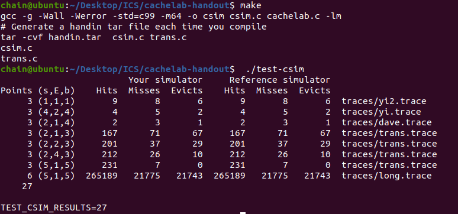
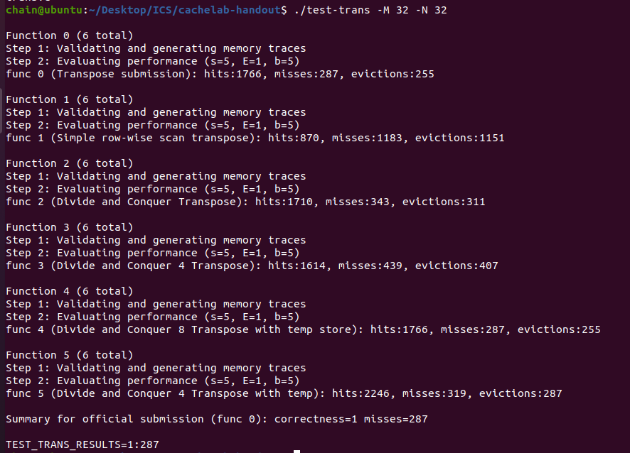
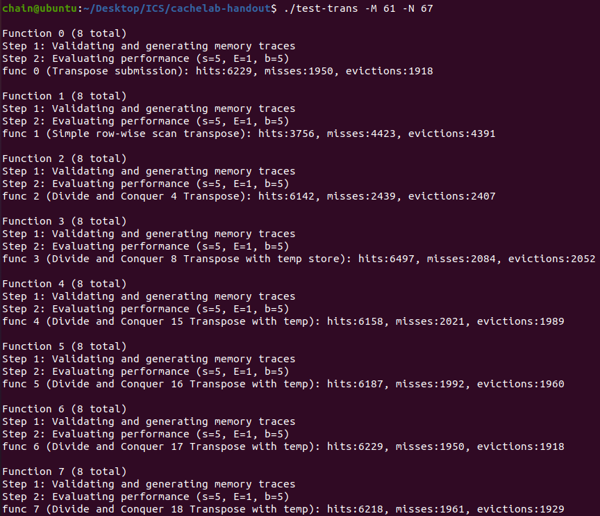
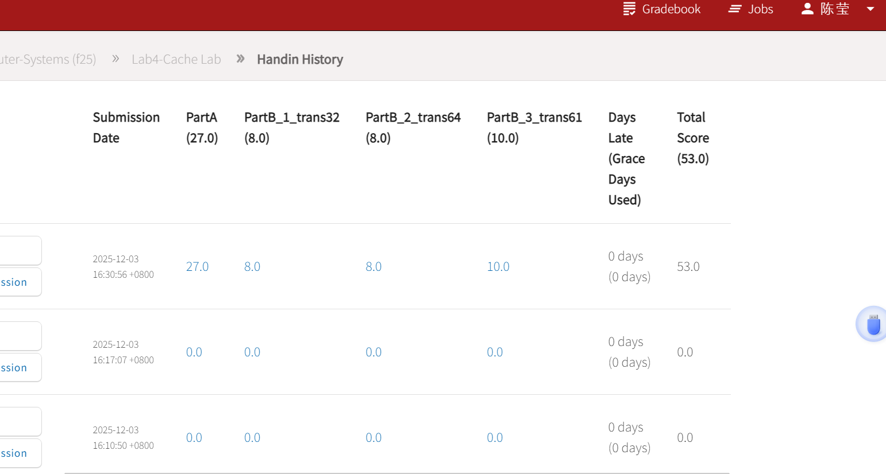

# Lab4-cachelab-handout Lab


* 实验时间：2025/12/4～2025/12/11
* 指导老师：杨哲慜
* 本次实验，我完成了所有内容。
## 目录

- [Lab4-cachelab-handout Lab](#lab4-cachelab-handout-lab)
  - [目录](#目录)
  - [实验目的](#实验目的)
      - [1. 编写一个模拟缓存存储器行为的小型C程序（约200-300行）](#1-编写一个模拟缓存存储器行为的小型c程序约200-300行)
      - [2. 优化一个小的矩阵转置函数，目标是尽量减少缓存未命中的次数。](#2-优化一个小的矩阵转置函数目标是尽量减少缓存未命中的次数)
  - [实验内容](#实验内容)
    - [1. csim.c](#1-csimc)
    - [2. trans.c](#2-transc)
  - [实验结果](#实验结果)
  - [遇到的问题及解决办法](#遇到的问题及解决办法)
  - [实验心得](#实验心得)
  - [其他备注](#其他备注)


## 实验目的
#### 1. 编写一个模拟缓存存储器行为的小型C程序（约200-300行）
#### 2. 优化一个小的矩阵转置函数，目标是尽量减少缓存未命中的次数。

## 实验内容

### 1. csim.c
思路：首先建立Cache,Cache 类似于一个二维数组，它有 S=2^s 组，每组有 E 行，每行存储的字节也是固定的。我用一个二维数组来模拟Cache，二维数组每一个最小的元素模拟存储b从0到2^(b-1)byte的一个CacheLine，由于本次只是模拟存储，不用真正存储，所以定义CacheLine时不用开2^b字节的地址存东西。    

其中，每行都有一个有效位，和一个标记位。想要查找到对应的字节，我们的地址需要三部分组成：
~~~
s，索引位，找到对应的组序号tag;
tag标记位，在组中的每一行进行匹配，判断能否命中;
b，块偏移，表明在找到的行中的具体位置。
~~~
题目中使用LRU，最近最少使用策略，替换最后一次访问时间最久远的哪一行，因此在CacheLine使用时间戳timestamp来记录已经多久没有用了。

代码：
```c
typedef struct  cache_line
{
    int valid;
    int tag;
    int timestamp;
    /* data */
}CacheLine;
typedef struct  mycache
{
    int S;
    int E;
    int B;
    CacheLine **lines;
    /* data */
}Cache;
```
接下来初始化Cache,为了方便使用cache，采用全局变量的方式，实现像类里面变量调用在多个函数里面使用。  

注意初始化：
~~~
组数S = 2^s
偏移B= 2^b
每组行数 E = e
用malloc分配cache内存空间
用malloc给二维数组cache->lines分配空间：
设置有效值、时间戳初始为0
设置tag为-1，因为标志tag范围时0~2^(机器位数-s-b)
~~~
别忘了最后要释放这些内存
```c
Cache *cache;
int hit_count ;
int miss_count ;
int eviction_count ;
int verbose ;
char t[1000];
void initCache(int s,int b,int e){
    int S_ = 1<<s;
    int B_ = 1<<b;
    cache = (Cache*)malloc(sizeof(Cache));
    cache->S = S_;
    cache->B = B_;
    cache->E = e;
    cache->lines = (CacheLine**)malloc(sizeof(CacheLine*)*S_);
    for (int i = 0; i < S_; i++)
    {
        cache->lines[i] = (CacheLine*)malloc(sizeof(CacheLine)*e);
        for (int j = 0; j < e; j++)
        {
            cache->lines[i][j].valid = 0;
            cache->lines[i][j].tag = -1;
            cache->lines[i][j].timestamp=0;
            /* code */
        }
        /* code */
    }
}
void freeCache(){
    for (int i = 0; i < cache->S; i++)
    {
        free(cache->lines[i]);
        /* code */
    }
    free(cache->lines);
    free(cache);
}
```
更新时间戳，无论命中还是不命中，只要找到这组这行，进行了操作，就要更新时间戳
代码：
```c
void update(int idx,int op_s,int op_tag){
    cache->lines[op_s][idx].valid = 1;
    cache->lines[op_s][idx].tag = op_tag;
    for (int i = 0; i < cache->E; i++)
    {
        if (cache->lines[op_s][i].valid)
        {
            cache->lines[op_s][i].timestamp++;
            /* code */
        }
        /* code */
    }
    cache->lines[op_s][idx].timestamp = 0;
}
```
先写最核心的更新cache逻辑，再回头看哪些需要补   
~~~
模拟器要做出的反馈有 3 种：
hit：命中，表示要操作的数据在对应组的其中一行
miss：不命中，表示要操作的数据不在对应组的任何一行 
eviction：驱赶，表示要操作的数据的对应组已满，进行了替换操作
~~~
因此我们首先判断命中否，决定hit_count++还是miss_count++，如果不命中，那么看是不是要驱逐，来判断是不是eviction_count++，只要查找到那块，都算操作了，时间戳归零，同组其他块时间戳++，也就是调用之前写好的update    
```c
void updateCache(int op_s,int op_tag){
    //
    int idx = findIdx(op_s,op_tag);
    if (idx==-1)
    {
        //miss
        miss_count++;
        if (verbose)
        {
            printf(" miss");
            /* code */
        }
        int empty_idx = findEmpty(op_s);
        //why miss
        if (empty_idx==-1){
            //conflict miss
            eviction_count++;
            if (verbose)
            {
                printf(" eviction");
                /* code */
            }
            empty_idx = findLRU(op_s);
        }
        //cold miss
        update(empty_idx,op_s,op_tag);
        /* code */
    }
    else
    {
        //hit
        hit_count++;
        if (verbose)
        {
            printf(" hit");
            /* code */
        }
        update(idx,op_s,op_tag);
        /* code */
    }
}
```
* 接下来实现几个判断函数：
```c
命中判断：
int findIdx(int op_s,int op_tag){
    //hit MISS return -1;
    //hit return idx
    for (int i = 0; i < cache->E; i++)
    {
        if (cache->lines[op_s][i].valid==1 && cache->lines[op_s][i].tag==op_tag)
        {
            return i;
            /* code */
        }
        /* code */
    }
    return -1;
}
不命中是否有空位（需不需要驱逐）判断：
int findEmpty(int op_s){
    //to write in empty idx
    for (int i = 0; i < cache->E; i++)
    {
        if (cache->lines[op_s][i].valid==0)
        {
            return i;
            /* code */
        }
        /* code */
    }
    return -1;
}
需要驱逐的话，找到时间戳最大的驱逐：
int findLRU(int op_s){
    //to del the max time
    int max_idx = 0;
    int max_time = 0;
    for (int i = 0; i < cache->E; i++)
    {
        if (cache->lines[op_s][i].timestamp>max_time)
        {
            max_time = cache->lines[op_s][i].timestamp;
            max_idx = i;
            /* code */
        }
        /* code */
    }
    return max_idx;   
}

```
最后处理一下输入：   
~~~
输入数据为[space]operation address, size

首先看看操作operation：
I 表示加载指令
L 加载数据
S 存储数据
M 修改数据
模拟器不需要考虑加载指令I，而M指令就相当于先进行L再进行S，因此，要考虑的情况其实并不多。

其次要看内存address结构：
tag|set(有s位)|block(有b位)
用位运算tag = address>>(s+b)，就算是算数右移也无所谓，反正同一个都一样能找到。
获取 s，先右移 b 位，再用无符号 0xFF...右移后进行与操作将 tag 抹去。C语言中的右移为算术右移，有符号数右移补位的数为符号位，但我要抹掉前面的tag，不能补符号位。
~~~

```c
void traceFile(int s,int E,int b){
    FILE* pf;
    pf = fopen(t,"r");
    if (pf == NULL)
    {
        exit(1);
        /* code */
    }
    char identy;
    unsigned address;
    int size;
    while (fscanf(pf," %c %x,%d",&identy,&address,&size)>0)
    {
        int op_tag = address>>(s+b);
        int op_s = (address>>b) & ((unsigned)(-1)>>(8 * sizeof(unsigned) - s));
        switch (identy)
        {
        case 'L':
            updateCache(op_s,op_tag);
            /* code */
            break;
        case 'M':
            updateCache(op_s,op_tag);
            updateCache(op_s,op_tag);
            /* code */
            break;
        case 'S':
            updateCache(op_s,op_tag);
            /* code */
            break;
        default:
            break;
        }
        /* code */
    }
}

```
main函数补充最后几行代码，大功告成：
```c
int main(int argc, char* argv[])
{
    char opt;
    int s,e,b;
    hit_count = miss_count = eviction_count = verbose = 0;
    while (-1!= (opt = getopt(argc, argv, "s:E:b:t:h")))
    {
        switch (opt)
        {
        case 'h':
            printf("Usage: ./csim-ref [-hv] -s <s> -E <E> -b <b> -t <tracefile>\n");
            exit(0);
        case 'v':
            verbose = 1;
            break;
        case 'b':
            b = atoi(optarg);
            break;
        case 's':
            s = atoi(optarg);
            break;
        case 'E':
            e = atoi(optarg);
            break;
        case 't':
            strcpy(t,optarg);
            break;
        default:
            break;
        }
        /* code */
    }
    
    initCache(s,b,e);
    traceFile(s,e,b);
    freeCache();
    printSummary(hit_count, miss_count, eviction_count);
    return 0;
}

```
实验结果：  


### 2. trans.c
思路：Part B 是在trans.c中编写矩阵转置的函数，在一个 s = 5, E = 1, b = 5 的缓存中进行读写，使得 miss 的次数最少。意味着分2^5=32组，每组就1行，每行能存2^5 = 32字节的数据，而转置int型4字节，一次能存矩阵一行的连续8个数。因此第一个实验32x32想到分8x8行。   
对于A中每一个操作块，只有每一行的第一个元素会不命中，所以为8次不命中；对于B中每一个操作块，只有每一列的第一个元素会不命中，所以也为 8 次不命中。总共miss次数为：8 × 16 × 2 = 256   
但是结果却miss了343次
```c
char trans_divide_desc[] = "Divide and Conquer Transpose";
void trans_divide(int M, int N, int A[N][M], int B[M][N])
{
    for (int i = 0; i < N; i += 8) {
        for (int j = 0; j < M; j += 8)
        {
            for (int k = 0; k < 8 && i+k<N; k++)
            {
                for (int t = 0; t < 8 && j+t<M; t++)
                {
                    B[j + t][i + k] = A[i + k][j + t];
                    /* code */
                }
                
                /* code */
            }
        }
    }
}
```
原来是A与B对角线上的块在缓存中对应的位置是相同的，而它们在转置过程中位置不变，所以复制过程中会发生相互冲突。题目给了提示：
~~~
You are allowed to define at most 12 local variables of type int per transpose function
~~~
每行A都存进本地变量，非对角线元素miss数量不变，对接线每行A都可以少miss6次   
```c
char trans_divide8_store_desc[] ="Divide and Conquer 8 Transpose with temp store";
void trans_divide8(int M,int N,int A[N][M],int B[M][N])
{
    int a0,a1,a2,a3,a4,a5,a6,a7;
    for (int i = 0; i < N; i += 8) {
        for (int j = 0; j < M; j += 8)
        {
            for (int k = 0; k < 8 && i+k < N ; k++)
            {
                a0 = A[i + k][j + 0];
                a1 = A[i + k][j + 1];
                a2 = A[i + k][j + 2];
                a3 = A[i + k][j + 3];
                a4 = A[i + k][j + 4];
                a5 = A[i + k][j + 5];
                a6 = A[i + k][j + 6];
                a7 = A[i + k][j + 7];
                B[j + 0][i + k] = a0;
                B[j + 1][i + k] = a1;
                B[j + 2][i + k] = a2;
                B[j + 3][i + k] = a3;
                B[j + 4][i + k] = a4;
                B[j + 5][i + k] = a5;
                B[j + 6][i + k] = a6;
                B[j + 7][i + k] = a7;
                /* code */
            }
        }
    }
}
```
结果：  
    

思路：64x64每4行就占满一个cache，每行占8组，尝试4x4分块
```c
char trans_divide4_desc[] = "Divide and Conquer 4 Transpose";
void trans_divide4(int M, int N, int A[N][M], int B[M][N])
{
    int a0,a1,a2,a3;
    for (int i = 0; i < N; i += 4) {
        for (int j = 0; j < M; j += 4)
        {
            for (int k = 0; k < 4 && i+k<N; k++)
            {
                a0 = A[i + k][j + 0];
                a1 = A[i + k][j + 1];
                a2 = A[i + k][j + 2];
                a3 = A[i + k][j + 3];
                B[j + 0][i + k] = a0;
                B[j + 1][i + k] = a1;
                B[j + 2][i + k] = a2;
                B[j + 3][i + k] = a3;
                /* code */
            }
        }
    }

}
```
没有满分，miss：1891次。还是考虑 8×8 分块，每块分成4x4再来处理，因为每4行就占满cache了，如果直接按照原来分块，4x4的第二块复制到第3块肯定miss很厉害。
~~~
考虑这样操作：
第一步：把A的第一块和第二块转置复制给B的第一块和第二块；
第二步：B的第二块是A转置后的第二块，本来应该是B的第三块的，用本地变量存储下来，将A的第三块复制给B的第二块，利用上述存储B的A转置后的第二块的本地变量，把A的转置后的第二块复制给B的第三块；
第三步：把A第四块转置复制给B的第四块；
~~~
```c

char trans_div4_store_desc[] ="Divide and Conquer 4 Transpose with temp";
void trans_div4_store(int M,int N, int A[N][M],int B[M][N]){
    int a0,a1,a2,a3,a4,a5,a6,a7;
    for (int  i = 0; i < N; i+=8)
    {
        for (int j = 0; j < M; j+=8)
        {
            for (int k = 0; k < 4 && i+k<N; k++)
            {
                a0 = A[i + k][j + 0];
                a1 = A[i + k][j + 1];
                a2 = A[i + k][j + 2];
                a3 = A[i + k][j + 3];
                a4 = A[i + k][j + 4];
                a5 = A[i + k][j + 5];
                a6 = A[i + k][j + 6];
                a7 = A[i + k][j + 7];
                B[j + 0][i + k] = a0;
                B[j + 1][i + k] = a1;
                B[j + 2][i + k] = a2;
                B[j + 3][i + k] = a3;
                B[j + 0][i + k + 4] = a4;
                B[j + 1][i + k + 4] = a5;
                B[j + 2][i + k + 4] = a6;
                B[j + 3][i + k + 4] = a7;

                /* code */
            }
            for (int k = 0; k < 4 && j+k<M; k++)
            {
                a0 = B[j + k][i + 4];
                a1 = B[j + k][i + 5];
                a2 = B[j + k][i + 6];  
                a3 = B[j + k][i + 7];
                a4 = A[i + 4][j + k];
                a5 = A[i + 5][j + k];
                a6 = A[i + 6][j + k];
                a7 = A[i + 7][j + k];

                B[j + k][i + 4] = a4;
                B[j + k][i + 5] = a5;
                B[j + k][i + 6] = a6;
                B[j + k][i + 7] = a7;

                B[j + k + 4][i + 0] = a0;
                B[j + k + 4][i + 1] = a1;
                B[j + k + 4][i + 2] = a2;
                B[j + k + 4][i + 3] = a3;
                /* code */
            }
            for (int k = 0; k < 4 && i+k+4<N ; k++)
            {
                a4 = A[i + k + 4][j + 4];
                a5 = A[i + k + 4][j + 5];
                a6 = A[i + k + 4][j + 6];
                a7 = A[i + k + 4][j + 7];
                B[j + 4][i + k + 4] = a4;
                B[j + 5][i + k + 4] = a5;
                B[j + 6][i + k + 4] = a6;
                B[j + 7][i + k + 4] = a7;
                /* code */
            }
            
            
            /* code */
        }
        
        /* code */
    }
}
```
结果：   
    

思路：61 × 67，miss为 2000 以下就可以了，因为非对称，cache每行存8个元素很难看出cache的miss次数，就慢慢试各种分块，一下是15、16、17、18分块：
```c
char trans_div15_store_desc[]="Divide and Conquer 15 Transpose with temp";
void trans_div15_store(int M,int N,int A[N][M],int B[M][N]){
    for (int i = 0; i < N; i+=15)
    {
        for (int j = 0; j < M; j+=15)
        {
            for (int k = 0;k < 15 && i+k<N; k++)
            {
                for (int t = 0; t <15 && j+t<M; t++)
                {
                    B[j + t][i + k] = A[i + k][j + t];
                    /* code */
                }
                /* code */
            }
        }
        /* code */
    } 
}
char trans_div16_store_desc[]="Divide and Conquer 16 Transpose with temp";
void trans_div16_store(int M,int N,int A[N][M],int B[M][N]){
    for (int i = 0; i < N; i+=16)
    {
        for (int j = 0; j < M; j+=16)
        {
            for (int k = 0;k < 16 && i+k<N; k++)
            {
                for (int t = 0; t <16 && j+t<M; t++)
                {
                    B[j + t][i + k] = A[i + k][j + t];
                    /* code */
                }
                /* code */
            }
        }
        /* code */
    } 
}
char trans_div17_store_desc[]="Divide and Conquer 17 Transpose with temp";
void trans_div17_store(int M,int N,int A[N][M],int B[M][N]){
    for (int i = 0; i < N; i+=17)
    {
        for (int j = 0; j < M; j+=17)
        {
            for (int k = 0;k < 17 && i+k<N; k++)
            {
                for (int t = 0; t <17 && j+t<M; t++)
                {
                    B[j + t][i + k] = A[i + k][j + t];
                    /* code */
                }
                /* code */
            }
        }
        /* code */
    } 
}
char trans_div18_store_desc[]="Divide and Conquer 18 Transpose with temp";
void trans_div18_store(int M,int N,int A[N][M],int B[M][N]){
    for (int i = 0; i < N; i+=18)
    {
        for (int j = 0; j < M; j+=18)
        {
            for (int k = 0;k < 18 && i+k<N; k++)
            {
                for (int t = 0; t <18 && j+t<M; t++)
                {
                    B[j + t][i + k] = A[i + k][j + t];
                    /* code */
                }
                /* code */
            }
        }
        /* code */
    } 
}
```
最后16、17、18分块都是2000以内，可以


## 实验结果


## 遇到的问题及解决办法

1. 遇到问题： 本地测试无问题，上传到autolab后，autograder output显示cannot stst 'handin/*' : No such file or directory，  - 修改Makefile文件第8-10行为后，本地编译报错

   解决方案：代码块第3、4、5行直接复制会变成空格，但是这个语法要求用Tab,手动加Tab就好了
   ```makefile
   all: csim test-trans tracegen
    # Generate a handin tar file each time you compile
    -@mkdir -p handin && cp csim.c trans.c handin/
    -tar -cvf handin.tar handin
    -@rm -rf handin
   ```


## 实验心得
了解cache，并且了解miss计算
（谈谈本次实验中，有哪些收获）

## 其他备注
无
（一般这里都写“无”就行了，假如遇到什么问题问了某某助教，助教让你先保留问题或者留个备注，可以写在这）