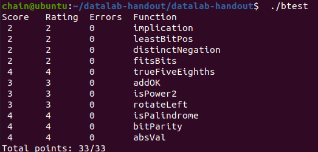
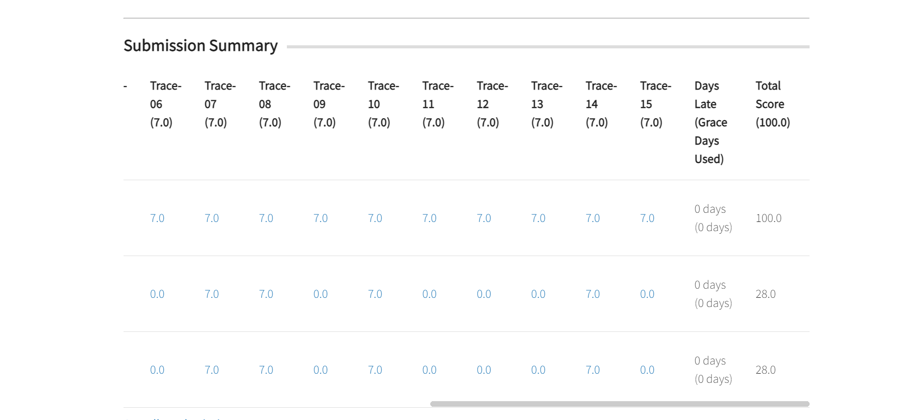

<style>
  img{
    display:block;
    margin-left:auto;
    margin-right:auto;
  }
  </style>
# Lab1-data Lab


* 实验时间：2025/9/25～2025/9/27
* 指导老师：杨哲慜
* 本次实验，我完成了所有内容。

## 目录
- [Lab1-data Lab](#lab1-data-lab)
  - [目录](#目录)
  - [实验目的](#实验目的)
  - [实验内容](#实验内容)
    - [1. implication](#1-implication)
    - [2. leastBitPos](#2-leastbitpos)
    - [3. distinctNegation](#3-distinctnegation)
    - [4. fitsBits](#4-fitsbits)
    - [5. trueFiveEighths](#5-truefiveeighths)
    - [6. addOK](#6-addok)
    - [7. isPower2](#7-ispower2)
    - [8. rotateLeft](#8-rotateleft)
    - [9. isPalindrome](#9-ispalindrome)
    - [10. bitParity](#10-bitparity)
    - [11. absVal](#11-absval)
  - [实验结果](#实验结果)
  - [遇到的问题及解决办法](#遇到的问题及解决办法)
  - [实验心得](#实验心得)
  - [其他备注](#其他备注)


## 实验目的

1. 通过解决puzzles来熟悉整数和常见运算或操纵的比特级呈现


## 实验内容

### 1. implication
```c
long implication(long x, long y) {
  // !(x& !y) = !x | y
  return (!x) | y;
}
```

* 截图：  



~~~~
后面的截图就省略了
~~~~

* 思路：
通过真值表
  
 - |  x  |  y  |  A  |
 - |  1  |  1  |  1  |
 - |  1  |  0  |  0  |
 - |  0  |  1  |  1  |
 - |  0  |  0  |  1  |  
  
发现除了x&y' = 0,其他都是1，通过整体取反，取反时与变或，就能求出结果

### 2. leastBitPos

```c
long leastBitPos(long x) {
  // (~x+1)&x,(~x+1)
  return ((~x) + 1L) & x;
}
```
  
思路：通过反码+1得到补码，那么只有最后只有最低一位和原码一样。

### 3. distinctNegation
```c
long distinctNegation(long x) {
  // x = ~x+1,0 => 2x = ~x+1+x=> x+x = 0
  return !!(x + x);
}
```

思路：在二进制补码里面，只有0和 -2^63次方没有补码，也就是说补码运算会出现溢出，最后变回自身。
通过x = ~x+1,0 => x+x = ~x+1+x=> x+x = 0发现。两次取反是为了使得一些结果非0的数字归一。

### 4. fitsBits
```c
long fitsBits(long x, long n) {
  // 64-n,IFx CAN n,1STALL
  long shift = 64L + ~n + 1L;
  return !(((x << shift) >> shift) ^ x);
}
```

思路：一个数左移64-n位再右移回来，只有n位是没有变动的，如果这个数能用n位二进制补码表示，那么移动改变的符号位和第n位的符号是一样的，那就是没有变，如果不一样，那就说明第n位不是符号位，是表示其数字大小的，才会出现±反转。

### 5. trueFiveEighths
```c
long trueFiveEighths(long x) {
  // 5/8 = (1/2+1/8)
  long sigh = x >> 63;
  long high = (x >> 3);
  long hh = (high << 2) + high;
  long low = x & 7L;
  long ll = (((low + (low << 2)) + (sigh & 7L)) >> 3);

  return ll + hh;
}
```

思路：分高低位进行乘法除法，高位会溢出，先除后乘。只有最低3位会导致向下取整问题，而只有负数要考虑向上取整，而负数补偿+7，这样的话如果能整除，加上7会被向下取整忽略，如果不能，那么加个7再除以8，一定会只进1位。

### 6. addOK
```c
long addOK(long x, long y) {
  // same xysihg,and s ^ xs
  long sum = (x + y) >> 63;
  long xs = x >> 63;
  long ys = y >> 63;
  long real = xs ^ ys;
  return !(xs ^ sum) | !(!real);
}
```

思路：判断溢出，如果是二进制原码，那么只要判断sum是否比任意一个数大就好了，但是现在是二进制补码，要知道负数和正数相加的话不管怎么样都不会溢出。而两个正数或负数溢出会影响符号位，所以用这个判断。

### 7. isPower2
```c
long isPower2(long x) {
  // - AND 0= 0,HAVE1,x&(x-1)==0
  long sigh = x >> 63;
  long pow = x & (x + (~0L));
  return (!sigh) & (!!x) & !pow;
}
```

思路：首先所有负数和0都不是2的幂。这个适合来判断是不是只有一个1。x-1会改变最低位的符号，其他高位的1不变，所以用这个来判断

### 8. rotateLeft
```c
long rotateLeft(long x, long n) {
  //-number need +7 ,then >>3. but big number need >>3,first
  long mask = (~0L) + (1L << n);
  long move = (64 + (~n + 1L));
  long re = (x >> move) & mask;
  long lf = x << n;
  return re | lf;
}
```

思路：首先我要存下左移会移出去的n位，用(~0L) + (1L << n)让只有后n位的数留下，不用~0L左移n是因为报错了，说把太多1移除去，可能识别以为~0L是-1了。  

把x右移64-n位，那么最右边n位就是会左移出去的，通过&存下来，也移到了右边，那么把这和左移完的合并。

### 9. isPalindrome
```c
long isPalindrome(long x) {
  // 01,0011,00001111,0000000011111111
  long mir1 = (0x55L << 8) | 0x55L;
  mir1 |= (mir1 << 16);
  long reverse = ((x & mir1) << 1) | ((x >> 1) & mir1);

  long mir2 = (0x33L << 8) | 0x33L;
  mir2 |= (mir2 << 16);
  reverse = ((reverse & mir2) << 2) | ((reverse >> 2) & mir2);

  long mir4 = (0x0fL << 8) | 0x0fL;
  mir4 |= (mir4 << 16);
  reverse = ((reverse & mir4) << 4) | ((reverse >> 4) & mir4);

  long mir16 = (0xffL << 8) | 0xffL;

  long mir8 = 0xffL;
  mir8 |= (mir8 << 16);
  reverse = ((reverse & mir8) << 8) | ((reverse >> 8) & mir8);
  reverse = ((reverse & mir16) << 16) | ((reverse >> 16) & mir16);

  reverse = (reverse << 32);
  x = ((x >> 32) << 32);

  return !(x ^ reverse);
}
```

思路：反转后32位，那么我们先让后32位的相邻两位反转，然后反转相邻4位，然后反转相邻8位，然后16位，这样完成后与高32位比较。  

在翻转过程中，注意到要求常数在0~255之间，所以还有构造出能翻转32位的数。  

在要和高32位比较时，注意右移会左边可能补充0/1，而左移低位必然补0，所以都在高位来比，而x = ((x >> 32) << 32)为了消去低32位。

### 10. bitParity
```c
long bitParity(long x) {
  // 1k ^ ->2k'S1
  x = x ^ (x >> 32);
  x = x ^ (x >> 16);
  x = x ^ (x >> 8);
  x = x ^ (x >> 4);
  x ^= (x >> 2);
  x ^= (x >> 1);
  return x & 1L;
}
```

思路：异或时，两个数的1的个数的数量的奇偶性不变，也就是说本来总共右m个1，异或后两个数是同时减少1的，所有减少2k个1.

### 11. absVal
```c
long absVal(long x) {
  // ALL 1=~ ,ALL0 = STILL
  long sigh = x >> 63;
  return (sigh ^ x) + (sigh & 1L);
}
```

思路：和全部都是1（~0L）异或等于取反，和全部0异或等于这个数本身，这样通过符号位构造就能实现绝对值


## 实验结果

  


## 遇到的问题及解决办法

1. 遇到问题：在rotateLeft里面，用~0L左移n是因为报错了，说把太多1移除去，可能识别以为~0L是-1了。  

   解决方案：最后用~0+(1<< n)这样就能实现保留后n位的目的了

2. 遇到问题：isPalindrome一开始想要两位两位换，结果一算32*3超过70次操作数了

   解决方案：构造0101···，0011···，00001111，0000000011111111来2，4，8，16来换，极大减少操作数

3. 遇到问题：trueFiveEighths一开始不知道怎么分开处理向零取整的问题。

    解决方案：通过负数补偿7来实现，而取最后7位用符号位右移补一与7取&来实现。这样分类讨论也省了

## 实验心得
更深刻地了解了位运算，了解到&、|、^、!和<<,>>在逻辑和运算里面的妙用，还有二进制补码下，左移右移对于不同数字的变化.
（谈谈本次实验中，有哪些收获）

## 其他备注
无
