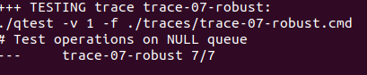
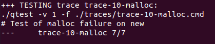
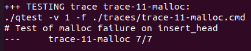
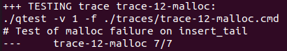
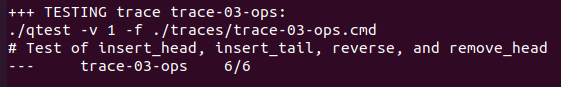
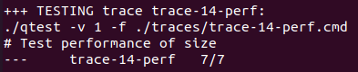
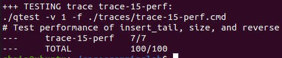

# Lab0-C Programming Lab


* 实验时间：2025/9/18～2025/9/22
* 指导老师：杨哲慜
* 本次实验，我完成了所有内容。
## 目录

[TOC]

## 实验目的
#### 编写queue.h和queue.c来实现链表的各种操作
1. queue_new: 创建新的空队列.
2. queue_free: 释放队列所有内存
3. queue_insert_head: 在队列头部插入新元素
4. queue_insert_tail: 在队列尾部插入新元素
5. queue_remove_head: 删除头部节点
6. queue_size: 计算队列元素数
7. queue_reverse: 不动用更改内存的情况下反转链表

## 实验内容

### 1. queue_new
代码：
```c
queue_t *queue_new(void) {
    queue_t *q = malloc(sizeof(queue_t));
    /* What if malloc returned NULL? */
    if (q==NULL)
    {
        return NULL;
        /* code */
    }
    q->head = NULL;
    q->size = 0;
    q->tail = NULL;
    return q;
}
```

截图：




思路：先给queue_t指针分配内存，然后让head和tail都指向空指针


### 2. queue_free
代码：
```c
void queue_free(queue_t *q) {
    /* How about freeing the list elements and the strings? */
    if (q==NULL)
    {
        return;
        /* code */
    }
    
    list_ele_t* curr = q->head;
    while (curr!=NULL)
    {
        list_ele_t* next = curr->next;
        free(curr->value);
        free(curr);
        curr = next;
    }
    q->size = 0;
    /* Free queue structure */
    free(q);
}
```

思路：每次都释放头节点，释放前线储存下一个节点，全部释放完后释放queue_t指针
### 3. queue_insert_head
代码：
```c
bool queue_insert_head(queue_t *q, const char *s) {
    list_ele_t *newh;
    /* What should you do if the q is NULL? */
    if (q==NULL||s==NULL)
    {
        return false;
        /* code */
    }
    
    newh = malloc(sizeof(list_ele_t));
    /* Don't forget to allocate space for the string and copy it */
    /* What if either call to malloc returns NULL? */
    if (newh==NULL)
    {
        return false;
        /* code */
    }
    newh->value = malloc(strlen(s)+1);
    if(newh->value==NULL){
        free(newh);
        return false;
    }
    strcpy(newh->value,s);
    newh->value[strlen(s)] = '\0';
    newh->next = q->head;
    q->head = newh;
    if (q->size == 0) {
        q->tail = newh;
    }
    q->size++;
    return true;
}
```
截图：


思路：分配内存给新节点，然后分配内存给value,复制过去，新节点指向列表的头节点的下一个节点，头指向新节点。

### 4. queue_insert_tail
代码：
```c
bool queue_insert_tail(queue_t *q, const char *s) {
    /* You need to write the complete code for this function */
    /* Remember: It should operate in O(1) time */
    if (q==NULL||s==NULL)
    {
        return false;
        /* code */
    }
    list_ele_t* newt = malloc(sizeof(list_ele_t));
    if (newt==NULL)
    {
        return false;
        /* code */
    }
    newt->value = malloc(strlen(s)+1);
    strcpy(newt->value,s);
    newt->value[strlen(s)] ='\0';
    newt->next = NULL;
    if (q->tail==NULL)
    {
        q->tail = newt;
        q->head = newt;
        
    }
    else
    {
        q->tail->next = newt;
        q->tail = newt;
    }
    q->size++;
    return true;
}

```

截图：

思路：在原来的queue_t里面设指针tail，在其他的方法里面同步注意修改，然后就直接移除就好了，在O(1)时间复杂度里实现

### 5. queue_remove_head
代码：
```c
bool queue_remove_head(queue_t *q, char *buf, size_t bufsize) {
    /* You need to fix up this code. */
    if (q == NULL || q->head == NULL) {
        return false;
        /* code */
    }

    if (buf != NULL && bufsize > 0) {
        size_t copy_len = strlen(q->head->value);
        if (copy_len >= bufsize) {
            copy_len = bufsize - 1; // 预留终止符位置
        }
        strncpy(buf, q->head->value, copy_len);
        buf[copy_len] = '\0'; // 强制添加终止符
    }
    list_ele_t *del = q->head;
    list_ele_t *next = q->head->next;
    free(del->value);
    free(del);
    q->head = next;
    if (q->head == NULL) {
        q->tail = NULL;
    }
    q->size--;
    return true;
}

```

截图：

思路：先判断是否空，再看复制留的内存够不够，不够也复制前面够的部分，最后都要留一个空位给休止符，然后调整head、tail、size

### 6. queue_size
代码：
```c
size_t queue_size(queue_t *q) {
    /* You need to write the code for this function */
    /* Remember: It should operate in O(1) time */
    if (q!=NULL&&q->head!=NULL)
    {
        return q->size;
        /* code */
    }
    return 0;
}

```

截图：


思路：在queue_t类里面增加一个size，在其他方法里面同步修改，这样，就能O(1)时间内完成size获取

### 7. queue_reverse
代码：
```c
void queue_reverse(queue_t *q) {
    /* You need to write the code for this function */
    if (q==NULL)
    {
        return;
        /* code */
    }
    list_ele_t* prev = NULL;
    list_ele_t* curr = q->head;
    list_ele_t* next = NULL;
    while (curr!=NULL)
    {
        next = curr->next;
        curr->next = prev;
        prev = curr;
        curr = next;
        /* code */
    }
    q->tail = q->head;
    q->head = prev;
}
```

截图：


思路：用迭代实现反转链表，prev储存上一个指针，curr是当前要转向的节点指针，next指向下一个节点，用来给curr移动的，在curr变向前存好。
## 实验结果

（一般截图自动评分系统最终对自己的评分即可）

## 遇到的问题及解决办法

1. 遇到问题：总是忘记判断新分配的节点有没有分配内存成功，导致ac了

   解决方案：每次使用malloc都查看一下有没有判断为空

2. 遇到问题：在queue_t结构体里面增加了tail和size后，在其他方法总是忘记改这两个

   解决方案：先有全局思维，先做要增加结构成员的题，然后再记在纸上，完成其他的函数


## 实验心得
本次实验让我更深刻的认识了队列这种数据结构，让我理解计算机的内存分配方式和地址相关知识，知道不连续的内存可以通过指针查找。
（谈谈本次实验中，有哪些收获）

## 其他备注
无
（一般这里都写“无”就行了，假如遇到什么问题问了某某助教，助教让你先保留问题或者留个备注，可以写在这）