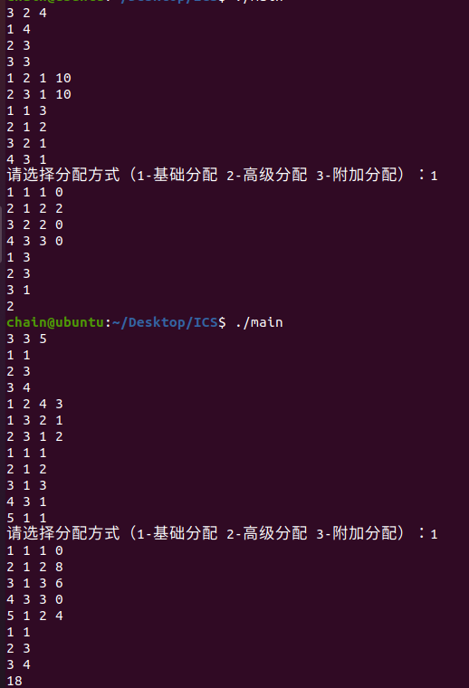
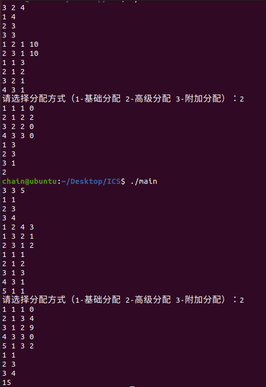
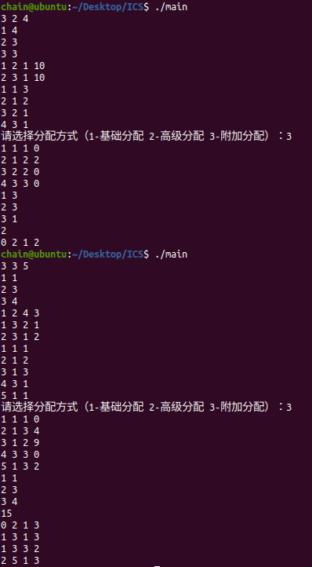

# 数据结构 Project：服务器集群负载均衡优化器

## 目录
- [数据结构 Project：服务器集群负载均衡优化器](#数据结构-project服务器集群负载均衡优化器)
  - [目录](#目录)
  - [整体实现思路](#整体实现思路)
    - [1. 实现基础数据结构](#1-实现基础数据结构)
      - [节点信息数据结构](#节点信息数据结构)
      - [任务信息数据结构](#任务信息数据结构)
    - [2. 网络设置](#2-网络设置)
  - [已实现功能的思路](#已实现功能的思路)
    - [1. 基础功能实现](#1-基础功能实现)
    - [2. 高级功能实现以及优化思路](#2-高级功能实现以及优化思路)
    - [3. 附加功能实现以及与高级功能对比的差异](#3-附加功能实现以及与高级功能对比的差异)
  - [展示测试用例及结果](#展示测试用例及结果)
  - [描述实现过程中收获](#描述实现过程中收获)

## 整体实现思路
### 1. 实现基础数据结构
#### 节点信息数据结构
设置节点Node结构体，包含包括节点编号、节点可用 GPU 数量和当前已使用的 GPU 数量。
#### 任务信息数据结构
  包含任务编号、初始节点ID、最终分配节点ID所需 GPU 数量、迁移成本（最短路径成本 ×GPU 数）、迁移完成状态及迁移路径节点序列，完整记录任务生命周期及迁移相关信息。

### 2. 网络设置
* 设一个Net类。   
* 将节点和任务用vector存着，用map<pair<int,int>,pair<double,double>> connect来存储ID对的链路信息。再存一下总花费等参数，这些足够实现基础功能。   
* 接下来实现一些必要的成员函数，来实现建立网络：首先是加节点buildNode和加任务addTask和建立连接buildConnect。由于节点的存储是用vector，要取出节点要建立一个id与索引映射。由于连接的建立是map，所以判断是否连接要一个isConnect函数判断，为了防止取连接越界，用linkInfo来取链接信息。为了打印出结构，增加一个printAssign函数来看分配结果，包括任务分配，节点gpu使用情况，迁移时间计划。    
* 最后在main函数调用Net类，用switch选择调用分配。但是我已经测试完三种分配了，因此将这个选择注释掉了，默认用最后的附加模式。   
## 已实现功能的思路
### 1. 基础功能实现
* 基础功能主要通过 assignBasic 函数实现，核心逻辑是基于 BFS 遍历连通节点，为任务分配第一个可用节点。为每个任务分配节点，优先使用任务的原始节点；若原始节点资源不足，则在与原始节点连通的节点中，按 BFS 遍历顺序选择第一个有足够 GPU 资源的节点，并计算迁移成本。   
* 对任务的原始节点执行 BFS：找到所有与原始节点连通的节点，并记录节点间的前驱关系。得到连通节点列表 connected_nodes 和前驱映射 predecessor。   
* 遍历 BFS 得到的连通节点，检查节点剩余 GPU 资源是否满足任务需求，若找到第一个满足条件的节点，将任务分配给该节点。若目标节点是原始节点，迁移成本为 0，标记is_migrated为false；若目标节点是其他连通节点，基于前驱映射predecessor重建迁移路径。     
  
通过上述逻辑，基础功能实现了任务的初步分配，并记录了迁移相关信息
### 2. 高级功能实现以及优化思路
高级功能assignAdvanced 函数的核心目标是为任务选择迁移成本最低的可用节点，通过预计算全节点对的最短路径，优先分配至成本最优的节点。   
- 本来想用迪杰斯特拉算法，但是考虑到只能得出单个点到所有点的最短路径，每个点要重新遍历，不如直接用Floyd算法。   
- 通过floyd函数预计算所有节点对之间的最短路径成本，存储在 f 数组中，及路径前驱节点，存储在 prev 数组中。f[i][j] 表示节点索引 i 到 j 的最短路径成本。prev[i][j] 用于后续重建 i 到 j 的最短路径。   
  
任务分配步骤：
~~~
优先检查原始节点：对每个任务，先检查其原始节点是否有足够剩余 GPU 资源，若有，则直接将任务分配给原始节点，无需迁移。

寻找成本最低的可用节点：若原始节点资源不足，则遍历所有其他节点，筛选出有足够剩余 GPU 资源并且从原始节点到该节点的最短路径成本最小的节点。

更新任务与节点信息：确定目标节点后，将任务分配给该节点，更新节点的 used_gpu，记任务为已迁移，计算迁移成本（最短路径成本 × 任务所需 GPU 数），通过getShortestPath函数，基于 prev 数组重建原始节点到目标节点的最短路径，并记录到任务的 path_nodes 中。
~~~
- 与基础功能的差异：基础功能通过 BFS 遍历连通节点，按顺序选择第一个可用节点；高级功能通过 Floyd 算法预计算全量最短路径，优先选择成本最低的节点，更注重迁移成本优化。  
     
- 从效率上看，Floyd 算法一次性计算所有节点对的最短路径，避免了基础功能中对每个任务单独执行 BFS 的重复计算，适合节点数量较多的场景。   
### 3. 附加功能实现以及与高级功能对比的差异
附加功能是在高级功能的基础上，新增链路带宽约束与迁移轮次规划，核心目标是让负载均衡策略贴合真实网络，即实际链路带宽有限，无法同时迁移所有任务。    

完全复用高级功能的核心逻辑：先通过 Floyd 算法计算最短路径，为每个任务选择目标节点和最短迁移路径。 
  
新增加带宽约束与轮次规划：
~~~
1. 先完成数据结构的建模，为每条网络链路设置带宽上限，对每个任务的最短迁移路径，拆解为路径上的所有链路。
2. 再对每个任务查找合适的轮次进行分配：
  初始化当前轮次 = 1，统计每轮各链路的已用带宽；
  遍历待迁移任务，检查其路径上所有链路的剩余带宽是否≥任务数量；
  若所有链路带宽满足，将任务分配至当前轮次，更新链路已用带宽；
  若带宽不足，将任务推迟至下一轮次，重置当前轮次的链路带宽统计，重复步骤 2-3；
~~~

## 展示测试用例及结果
基础功能结果：   
       
高级功能结果：   
    
附加功能结果：   
    
我已经测试完三种分配了，因此将这个选择注释掉了，默认用最后的附加模式。   
## 描述实现过程中收获
- 更深刻地了解了图的几大遍历方式和最短路径选取。
- 对数据结构的建模有了初步的了解和能力提升。
